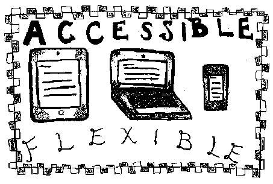
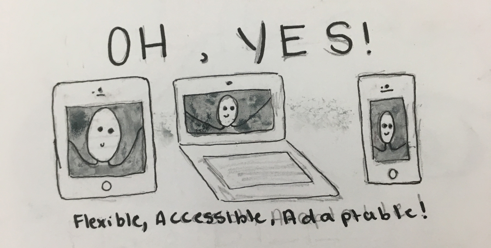
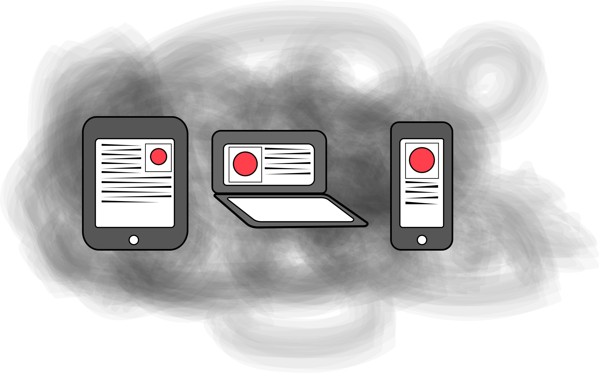

# Ebb & Flow
## Work in Progress

- [Draft](#draft)
- [Revision](#revision)
- [Best Practice](#best-practices)

- - -

# Draft

## A Dao of Web Design Summary

### By Jaime Fox

The article A Dao of Web Design written by John Allsopp overall talks about the need for adaptability of fonts, layouts, and colors within websites. Allsopp uses the philosophy of Daoism, stemming from the philosophy book Tao Te Ching, which focuses on the theme of harmony, to compare the harmony needed in order to create a successful and adaptable website. We as designers need to not only think about the web “as we know it” but also “as it would be,” meaning our ideologies about the web and how to design in general must be flexible to the way the world is constantly adapting and improving over time. Web design was taken from print and is constantly changing and adapting in order to make it successful off of a screen of any size as opposed to paper, which is difficult since the resolution of computers is worse than that of paper. This way of constant change is hard for designers because they are controlling and want to create a specific layout as opposed to letting the flexibility take place in order to make a web page usable. These designers must adapt to unexpected outcomes in order for the industry to continue to flourish. Another main topic from this article is that when designing a web page, you must focus on what the pages do instead of how they look, to an extent (form follows function). If you are going for a more informational website then using HTML is more appropriate, whereas if you are focusing on the design element, using style sheets would be better. Overall, when building a website, just be sure to keep proportions in mind as well as adaptability, or how users can view it the way they need to on their own screens (while staying in the proportions the designer chose).

- - -

# Revision

## A Dao of Web Design: A Summary

### By _italic_Jaime Fox_italic_

The article _A Dao of Web Design_ written by John Allsopp overall talks about the need for adaptability of fonts, layouts, and colors within websites. Allsopp uses the philosophy of Daoism, stemming from the philosophy book _Tao Te Ching_, which focuses on the theme of harmony, to compare the harmony needed in order to create a successful and adaptable website. 
 
We as designers need to not only think about the web “as we know it” but also “as it would be,” meaning our ideologies about the web and how to design in general must be flexible to the way the world is constantly adapting and improving over time. Web design was taken from print and is constantly changing and adapting in order to make it successful off of a screen of any size as opposed to paper, which is difficult since the resolution of computers is worse than that of paper. This way of constant change is hard for designers because they are controlling and want to create a specific layout as opposed to letting the flexibility take place in order to make a web page usable. These designers must adapt to unexpected outcomes in order for the industry to continue to flourish. 

Another main point from this article is that when designing a web page, you must focus on what the pages do instead of how they look, to an extent (form follows function). If you are going for a more informational website then using HTML is more appropriate, whereas if you are focusing on the design element, using style sheets would be better. Overall, when building a website, just be sure to keep proportions in mind as well as adaptability, or how users can view it the way they need to on their own screens (while staying in the proportions the designer chose). 
 
 ### Things to Take Away
   - Keep it simple, do not overdo the formatting, keep it appropriate for the web
   - Adapt to those unexpected outcomes
   - Think about what the pages do as opposed to how they look
   - Do not rely on pixels or color
   - Make fonts/ font size changable per viewer
   - Use proportional sizing so that no matter what screen the viewer is looking at, it stays proportional (using percentages)
   - BE FLEXIBLE, ADAPT WITH TIME

# About the Author 

Jaime Fox is a 19 year old girl from Framingham, MA. She currently is a sophomore at Montserrat College of Art in Beverly, MA. She plans on majoring in Graphic Design.
- - -

## Best Practices

### Naming (Conventions) Things

- Use lowercase for naming files, folders, and in markup
- Use a hyphen (-) or an underscore (_) and not a space (%20) when separating phrases in naming files, folders, and in markup

### Project (Folder, Repo) Structure

#### For Example

- project-name
  - README.md
  - index.md
  - index.html
  - img/ (folder)

